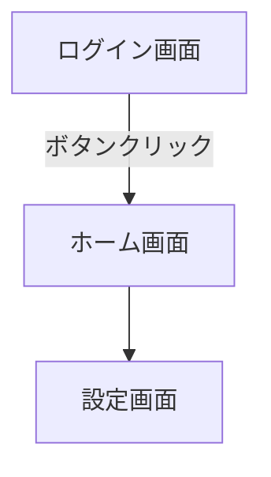

# 🔰 GitHub 完全初心者向けガイダンス

GitHub（ギットハブ）の基本概念から、画面上部にある全タブメニューの機能までをまとめた、初心者向けの解説書（備忘録）です。

---

## 1. 最初に覚える「4つの最重要 git 用語」

GitHubを操作する上で、ベースとなる基本の4ステップです。

* **リポジトリ (Repository)**：プロジェクトの「貯蔵庫」（フォルダのようなもの）。コードや画像をすべてここに保存します。
* **コミット (Commit)**：ファイルの追加や変更を**「記録・保存」**する操作。誰がいつ何を変えたかが履歴に残ります。
* **プッシュ (Push)**：自分のパソコン内（ローカル）の変更を、インターネット上のGitHub（リモート）へ**「アップロード」**する操作。
* **プル (Pull)**：GitHub上にある最新のデータを、自分のパソコンへ**「ダウンロード」**して同期させる操作。

💡 **画像の保存について**：画像ファイル（PNG/JPEGなど）も、コードと全く同じ方法でリポジトリに保存・管理できます。

---

## 2. 上部タブメニューの全機能解説

リポジトリの上部に並んでいる各メニューの役割一覧です。

| 機能名 | 読み方 | ざっくり言うと何？ | 詳しい使い方・使い道 |
| :--- | :--- | :--- | :--- |
| **Issues** | イシューズ | **やることリスト・掲示板** | バグの報告、新機能のアイデア、次にやるべきタスク（ToDo）を書き込んで管理・議論する場所。 |
| **Pull requests** | プルリクエスト | **変更内容のレビュー依頼** | 「コードを修正したから、問題ないか確認して本番（メイン）に合流させて！」とチームに提案する場所（通称：プルリク）。 |
| **Agents** | エージェント | **AI開発アシスタント** | AIがプロジェクトのコードを分析し、エラーの解決やコード作成、自動化をサポートしてくれる先進機能。 |
| **Actions** | アクションズ | **作業の自動化ロボット** | 「コードが更新されたら自動でテストする」「自動でホームページを公開する」といった面倒な作業の自動化。 |
| **Projects** | プロジェクト | **タスク管理ボード** | 「未着手」「進行中」「完了」の列を作り、Issues（タスク）をカードのように動かして進捗を視覚的に管理するボード。 |
| **Security** | セキュリティ | **安全パトロール** | コードの中にパスワードが生で書かれていないか、バグや危険な欠陥がないかを自動 check してくれる機能。 |
| **Insights** | インサイト | **活動データの分析レポート** | 誰が一番たくさんコードを書いているか、何曜日にコミットが多いかなど、開発の統計をグラフで分析できる場所。 |
| **Settings** | セッティングス | **リポジトリの設定部屋** | リポジトリの名前変更、公開/非公開の切り替え、一緒に開発するメンバーの招待などを行う管理画面。 |

# 🚀 GitHub 応用・活用ガイド

GitHubの基本操作に慣れた後、より効率的な開発、情報共有、そして自身の学習記録を資産化するための便利機能と活用手順をまとめたドキュメントです。

---

## 1. 次にステップアップするための便利機能
基本操作に慣れた後、より効率的な開発や情報共有を行うための2つの重要機能です。

### ① ブランチ (Branch) の具体的な仕組みと手順
* **概要**：メインのファイル（`main`）の履歴の流れから分岐させ、独立した開発用の作業スペースを作る機能です。稼働中のプログラムを壊すことなく、新しい機能の追加やテストを安全に行うことができます。
* **Web画面での操作手順**：
  1. リポジトリのトップ画面左上にある **[main]** と書かれたプルダウンメニューをクリックします。
  2. 入力欄に新しく作りたいブランチの名前（例：`add-new-feature`）を半角英数字で入力します。
  3. 下部に表示される **[Create branch: 入力した名前 from 'main']** をクリックします。これで画面が切り替わり、新しいブランチ内での作業が可能になります。
* **マージ（結合）の手順**：
  分岐したブランチ側でファイルの新規作成や編集、コミット（保存）を行った後、画面上に表示される **[Compare & pull request]** ボタンをクリックします。内容を確認し、問題がなければ **[Create pull request]** ➔ **[Merge pull request]** ➔ **[Confirm merge]** の順にクリックすることで、編集した内容がメインのファイル（`main`）へと安全に結合されます。

### ② Gist（ギスト）の具体的な仕組みと手順
* **概要**：プロジェクト単位の大きな「リポジトリ」を作成するまでもない、数行だけのプログラムの断片（スニペット）や、単一のテキストメモを個別に保存・公開して共有できる機能です。
* **具体的な操作手順**：
  1. 画面右上にある **[＋]** マークのボタンをクリックし、メニューから **[Create new gist]** を選択します。
  2. `Gist description...` にメモの概要を、`Filename including extension...` にファイル名（例：`memo.txt` や `snippet.js`）を入力します。
  3. 下部の大きなテキストエリアに、保存したいテキストやコードを記述します。
  4. 画面右下にあるボタンをクリックして作成します。
     * **Create secret gist**：URLを知っている人のみ閲覧できる非公開状態。
     * **Create public gist**：インターネット上に公開され、誰でも検索して閲覧できる状態。
* **メリット**：作成後に発行される個別のURLを相手に送るだけで、特定のプログラムコードだけをすっきりと見やすい状態で提示できます。

---

## 2. GitHubを利用する目的と3つの実用的なメリット
単にファイルを保存するだけでなく、プログラミング学習や共同開発を円滑に進めるための重要な役割があります。

### ① 過去の正常な状態への復元（履歴管理）
* **メリット**：コードを変更したことでエラーが発生し、元の状態に戻せなくなった場合でも、こまめに「コミット（保存）」を行っていれば、正常に動いていた過去の時点へいつでも正確に戻すことができます。
* **具体的な使い方**：GitHubの履歴（History）機能を使用すると、過去のコードと現在のコードの変更箇所が画面の左右に並べて比較表示されます。これにより、どの行を書き換えたことでエラーが起きたのか、原因の特定が容易になります。

### ② 本番環境に影響を与えない検証（安全な開発）
* **メリット**：すでに完成しているプログラムを書き換えることなく、新しい機能やデザインのテストを行うことができます。
* **具体的な使い方**：上記で解説した「ブランチ（枝分かれ）」機能を使用し、メインのファイルから複製データを作ってその中で編集を行います。検証が成功した場合は本番のコードに合流（マージ）させ、失敗した場合はその分岐データだけを消去します。本番環境のコードを汚さずに新しい挑戦が可能です。

### ③ 技術力と継続的な学習の証明（資産化）
* **メリット**：自身が作成したソースコードをインターネット上に公開しておくことで、他者に対して自分の技術力を客観的に証明できます。
* **具体的な使い方**：進学や就職活動、インターンシップの面接の際、リポジトリのURLを提示します。面接官はコードの書き方の丁寧さや、どれくらい頻繁に作業を行っているか（草の生え具合）を直接確認できるため、口頭で説明する以上の確実な実績アピールになります。

---

## 3. 【基本操作】GitHubウェブ画面上でのファイルの使い方と手順
外部のソフトウェアを使わず、ブラウザ上のGitHub画面だけでファイルを操作する基本的な手順です。

### ① ファイルを新しく作成する方法
1. リポジトリのトップ画面右側にある **[Add file]** ボタンをクリックし、メニューから **[Create new file]** を選択します。
2. 「Name your file...」の欄に、拡張子（例：`index.html` や `script.js`）を含めたファイル名を入力します。
3. 下部のテキストエリアにコードを記述します。
4. 画面右上の **[Commit changes...]** をクリックし、ポップアップ内の緑色の **[Commit changes]** を押して保存します。

### ② ファイルを編集・上書きする方法
1. リポジトリのファイル一覧から、編集したいファイル名をクリックして開きます。
2. 画面右上にある **[鉛筆マーク（✎）]** ボタンをクリックすると編集画面に切り替わります。
3. 必要に応じてテキストを修正・追記します。
4. 作成時と同様に、右上の **[Commit changes...]** ➔ ポップアップ内の **[Commit changes]** の順にクリックして変更を反映します。

### ③ ファイルを削除する方法
1. 削除したいファイル名をクリックして開きます。
2. 画面右上にある **[ゴミ箱マーク]**（または鉛筆マークの横にある「…」メニューから **[Delete file]**）をクリックします。
3. 画面右上の **[Commit changes...]** ➔ ポップアップ内の **[Commit changes]** をクリックして削除を確定します。

---

## 4. 【初期設定】初心者がまず最初に進めるべき3ステップ（PC連携）
GitHubを実際のパソコン（ローカル環境）と連携させて導入するための具体的な手順です。

### 1️⃣ GitHub Desktopの導入
* コマンド（ターミナルやコマンドプロンプトなどの黒い画面）による操作は、入力ミスによるファイルの紛失リスクがあるため、初心者にはマウス操作だけで完結する公式の無料アプリ「GitHub Desktop」の使用を推奨します。

### 2️⃣ リポジトリのクローン（複製・ダウンロード）
1. 公式サイトからダウンロードした GitHub Desktop を起動し、メニューから **[Clone a repository]** を選択します。
2. Web上で作成したご自身のリポジトリ一覧が表示されるので、その中から対象のリポジトリ（例：`GitHub_guidance`）を選択します。
3. `Local Path`（保存先フォルダ）を確認し、**[Clone]** ボタンをクリックすると、お使いのパソコン内に専用フォルダが作成され、同期が完了します。

### 3️⃣ パソコン側での編集とプッシュ（反映・アップロード）
1. 作成されたパソコン内のフォルダを開き、`README.md` をテキストエディタ（VS Codeなど）で開きます。
2. 文末にテスト用の文章（例：「パソコンからの書き込みテスト」）を1行書き足してファイルを保存します。
3. GitHub Desktopアプリに戻ると、変更を加えた箇所が自動で検出され、緑色の背景で画面に表示されます。
4. 画面左下の `Summary`（必須の入力欄）に、変更内容のメモ（例：「READMEにテスト追記」）を入力し、**[Commit to main]** ボタンをクリックします。
5. 最後に画面上部に出現する **[Push origin]** ボタンをクリックすると、Web上のGitHubに最新の状態が反映されます。

---

## 5. リポジトリを「学習ノート・ポートフォリオ」としてさらに活用する機能
プログラムコードだけでなく、GitHubの標準機能や外部連携ツールを使用することで、より高度な学習記録や実績アピールを作成できます。

### ① マークダウン（Markdown）記法を活用した見やすいドキュメント作成
`README.md`に文字を記述する際、特定の記号を使用することで、テキストを装飾し情報を整理できます。
* **リンクの埋め込み**： `[テキスト](URL)` の形式で書くと、外部の参考サイトへのリンクを作成できます。
* **チェックリストの作成**： `- [ ] タスク名` と書くと、画面上にクリック可能なチェックボックスが表示され、学習の進捗管理に利用できます。
* **コードの強調（シンタックスハイライト）**： バッククォート3つ（\`\`\`）の後に言語名（例：`html`）を書き、コードを挟むと、実際の開発ソフトのようにコードに色がつき、格段に読みやすくなります。

### ② Mermaid（マーメイド）機能を使用した「画面遷移図・フローチャート」のコード化
画像ファイルを用意しなくても、README内に専用のテキストコードを記述するだけで、GitHubが自動的に綺麗な画面遷移図やフローチャートのグラフを生成・表示してくれます。

* **メリット**：テキストデータとして図を管理できるため、後から画面の流れやボタンの配置が変わった際にも、文字を数文字書き換えるだけで図の修正が完了します。

### ③ 外部公開機能（GitHub Pages）を用いた成果物の提示
HTML、CSS、JavaScriptで作成した静的なWebサイトを、ボタン一つで実際のインターネット上に公開し、誰でも閲覧できるURLを発行できる無料機能です。
* **操作手順**：
  1. リポジトリの上部タブメニューから **[Settings]** をクリックします。
  2. 左側メニューの「Code and automation」内にある **[Pages]** を選択します。
  3. Build and deploymentの「Branch」の項目で、`None` から **[main]** に切り替えて **[Save]** をクリックします。
  4. 数分後、画面最上部に公開されたサイトのURL（例：`https://github.io`）が表示されます。

### ④ エラーと解決策の記録
学習中に出会ったエラーメッセージと、その対処法はREADMEや「Issues」に記録しておくことをおすすめします。
* **書き方のテンプレート**
  * **【発生した現象】**：〇〇というエラーメッセージが表示された
  * **【原因】**：コードの3行目のスペルミス、または全角スペースの混入
  * **【解決策】**：〇〇と書き直したことで正常に動作した
* **メリット**：時間の経過とともにエラーの解決策は忘れてしまいがちですが、このように記録を残しておくことで、将来同じような問題に直面した際に、自身で素早く解決するための確実な参考資料になります。

---

## 6. プロフィール画面のアクティビティ記録（コントリビューション）の詳細と応用機能
プロフィール画面の緑色のマス目（コントリビューション）は、作業の継続性を証明するだけでなく、さまざまな外部機能や連携方法が存在します。

### ① コントリビューションとしてカウントされる4つの詳細条件
* デフォルトブランチ（通常は`main`）への直接のコミット、または別ブランチからのマージ（結合）。
* Issue（課題）へのコメント投稿や、Pull Requestに対するレビューコメントの記述。
* 他者の公開リポジトリを自身の環境に複製（Fork）し、そこにコミットを行った場合。
* ⚠️ **注意**：非公開（Private）リポジトリでの作業は、初期状態では本人にしか緑色のマス目が見えません。他者に公開したい場合は、プロフィール設定で「Private contributions」の表示を有効にする必要があります。

### ② プロフィール専用リポジトリ（Profile README）の作成機能
あなた自身のプロフィール画面の一番上に、自己紹介や得意なプログラミング言語、現在の学習目標などを大きく表示できる特別な機能です。
* **具体的な作成手順**：
  1. 画面右上にある **[＋]** マークから **[New repository]** を選択します。
  2. `Repository name` に、**あなた自身のGitHubユーザー名と完全に同じ文字列**を入力します。
  3. 画面に「You found a secret!（秘密の機能を見つけました）」という通知が表示されます。
  4. リポジトリの公開設定を必ず **[Public]** にし、**[Add a README file]** にチェックを入れて作成します。
* **メリット**：作成された`README.md`に自己紹介や学習中の記録を書き込むと、他のユーザーがあなたのプロフィールページを訪問した際に、最初にその内容が自動表示されるため、強力な自己アピールになります。

### ③ 外部ツール（GitHub Readme Statsなど）を用いた実績グラフの埋め込み
世界中の開発者が公開している無料の外部ツールを利用することで、自分のプロフィールREADMEの中に、「これまでに使ったプログラミング言語の比率グラフ」や「現在の総合コミット数カード」を自動表示させることができます。
* **メリット**：外部ツールの指定コードを1行書き込んでおくことで、GitHubが自動的にあなたの全リポジトリからデータを集計し、常に最新の綺麗なグラフ画像をプロフィール上に表示し続けてくれます。

---

## 7. 知っておくと役立つ「右上【＋】メニュー」の機能と具体的活用手順
画面右上にある「＋」マークのボタンから作成できる、効率的な開発やタスク管理をサポートする3つの機能の具体的な操作と活用方法です。

### ① 新しいコードスペース (Codespaces)
* **概要**：自身のパソコンに開発ソフトをインストールすることなく、ブラウザ上でクラウド上の開発環境（VS Code）を起動し、プログラムの記述・実行・デバッグができる機能です。
* **具体的な操作手順**：
  1. 画面右上にある **[＋]** から **[New codespace]** を選択します。
  2. `Repository` の項目で、開発を行いたい自身のリポジトリを選択します。
  3. `Branch` で作業するブランチ（通常は `main`）を選択し、**[Create codespace]** をクリックします。
  4. ブラウザが切り替わり、画面上に使い慣れたエディタ（VS Code）が表示され、数秒で開発を開始できる状態になります。
* **実用的な使いどころ**：学校のパソコンやタブレットなど、独自のソフトウェアをインストールできない環境や、端末の処理性能が低い環境からでも、インターネット経由でリポジトリのコードを直接書き換えて実行確認をしたい場合に最適です。

### ② 新しい要点 (Gist：ギスト)
* **概要**：上記「1番-②」で解説した、数行のコードの断片やテキストメモを個別に保存・共有できる機能の作成画面へのショートカットです。
* **具体的な操作手順**：
  1. 画面右上にある **[＋]** から **[Create new gist]** を選択します。
  2. `Gist description...` に「〇〇エラーの解決用コード」などの概要を入力します。
  3. `Filename including extension...` にファイル名（例：`reset.css` や `fetch.js`）を入力します。
  4. 下部のテキストエリアにコードを貼り付け、右下の **[Create secret gist]**（URLを知っている人のみ閲覧可能）または **[Create public gist]**（一般公開）のいずれかを選択して保存します。
* **実用的な使いどころ**：オンラインコミュニティやSNS、または知人に対して「この数行のプログラムコードを確認してほしい」と伝える際、テキストの体裁を崩さずにURLだけでスマートに共有したい場合に重宝します。また、履歴が残るため「自分専用のコードの部品置き場」としても活用できます。

### ③ 新しいプロジェクト (Projects)
* **概要**：作業タスク（Issues）をカード形式で配置し、進捗状況（未着手・進行中・完了など）をドラッグ＆ドロップで視覚的に動かしながら管理できるタスク管理ボード機能です。
* **具体的な操作手順**：
  1. 画面右上にある **[＋]** から **[Create new project]** を選択します。
  2. テンプレート選択画面が表示されるので、まずは一番使いやすい **[Board]** を選択して **[Create project]** をクリックします。
  3. 画面上に「Todo」「In Progress」「Done」という3つの列（ステータス）が表示されます。
  4. 各列の下部にある **[+ Add item]** をクリックし、「〇〇画面のボタンを作成する」「READMEを修正する」といった具体的なタスクを入力してカードを作成します。
  5. 作成したカードは、マウスのドラッグ操作で「Todo ➔ In Progress ➔ Done」へと進捗に合わせて自由に移動させることができます。
  6. さらに、このカードはリポジトリ内で作成した **「Issues（課題）」** と連動させることが可能で、該当のIssueが解決（Close）されると、プロジェクトボード上のカードも自動的に「Done（完了）」へと移動するように設定できます。これにより、個人の開発タスクを視覚的かつ自動的に一元管理できるようになります。
 
# 🛠️ GitHub 実戦マスター・ロードマップ

このドキュメントは、文字を読むだけでなく**「実際に手を動かしてGitHubを自分の道具として使いこなす」**ための実戦ガイドです。
最もよく使う「基本のループ」と、つまずきやすい「応用機能」の操作手順を、迷わない一本の道筋としてまとめています。

---

## 🔁 1. 【基本のループ】パソコンからネット公開までの4ステップ
GitHubを使いこなすための基本サイクルです。開発時は常にこのループを回します。

### ① 【パソコン側】ファイルの作成と編集
1. パソコンのテキストエディタ（VS Codeなど）を開きます。
2. フォルダ内に **`index.html`** という名前でファイルを作ります。
3. 画面に表示したいコード（例：`<h1>私のWebサイトへようこそ</h1>`）を書き、ファイルを普通に保存します。

### ② 【アプリ側】パソコンからGitHubへデータを送る（Commit & Push）
公式の無料アプリ「GitHub Desktop」を使い、マウス操作だけでネット上のGitHubにデータをアップロードします。
1. アプリ「GitHub Desktop」を起動します。
2. 画面左側に、先ほど編集したファイルの名前（`index.html`）が緑色の背景で自動検出されているのを確認します。
3. 画面左下にある **`Summary`** という空欄に、変更内容のメモ（例：`トップページを作成`）を日本語で入力します。
4. そのすぐ下にある青い **[Commit to main]** ボタンをクリックします（これでパソコン内にセーブされます）。
5. 画面上部、または中央に出現する大きな **[Push origin]** ボタンをクリックします（これでネット上のGitHubにアップロードされます）。

### ③ 【ウェブ側】世界中にWebサイトを無料公開する（GitHub Pages）
アップロードしたファイルを、ボタン一つで実際のインターネット上に公開します。
1. ブラウザでGitHubを開き、自分のリポジトリのトップ画面に行きます。
2. 上部メニューの右端にある **[Settings]（歯車マーク）** をクリックします。
3. 左側のサイドメニューから、**[Pages]** を選択します。
4. 画面中央の「Branch」という項目で、初期状態の `None` から **`main`** に切り替えます。
5. すぐ横にある **[Save]** ボタンをクリックします。
6. **1〜3分ほど** 待ってから画面を再読み込み（リフレッシュ）すると、画面の最上部にサイトの**公開URL**（`Your site is live at...`）が表示されます。

### ④ 【自動化】変更をリアルタイムに反映する
* 一度この設定を済ませれば、次回からは **①パソコンで編集 ➔ ②アプリでPush** を行うだけで、**自動的にネット上のWebサイトも数分で最新の状態に更新**されます。

---

## 🌿 2. 【応用機能】本番のコードを壊さない「実験室」（ブランチ）
Webサイトが完成した後、新しいデザインや機能を安全にテストするための機能です。

### ① 実験室（新しいブランチ）を作る
1. リポジトリのトップ画面左上にある **[main]** と書かれたプルダウンメニューをクリックします。
2. 入力欄に、新しく作りたい実験用の部屋の名前（例：`new-style`）を半角英数字で入力します。
3. 下に出現する **[Create branch: 入力した名前 from 'main']** をクリックします。
4. これで画面が切り替わり、安全な実験室に入れます。この中で自由にファイルを書き換えて保存してください。

### ② 実験の成果を本番（main）に合流させる（マージ）
1. 実験用のブランチで編集と保存（コミット）を終えると、画面上に **[Compare & pull request]** というボタンが自動で出るのでクリックします。
2. 内容（どこを書き換えたか）を確認し、緑色の **[Create pull request]** ボタンをクリックします。
3. GitHubがバグを自動チェックしてくれます。緑のチェックが出たら、**[Merge pull request]** ➔ **[Confirm merge]** の順にクリックします。
4. これで実験した内容が、本番の部屋（`main`）に安全に合流し、Webサイトにも反映されます。

---

## 📝 3. 【単発共有】数行のコードをサッと共有する（Gist）
大きなプロジェクトを作るまでもない、1枚だけのメモや数行のプログラムを個別に保存・公開して共有できる機能です。

### 🛠 操作手順
1. GitHub画面の右上にある **[＋]** マークから **[Create new gist]** を選択します。
2. `Gist description...` にメモのタイトル（例：`CSSの初期化`）を、`Filename...` にファイル名（例：`reset.css`）を入力します。
3. 下のテキストエリアにコードを貼り付けます。
4. 画面右下のボタンを選択します。
   * **[Create secret gist]**：URLを知っている人のみ閲覧できる限定公開。
   * **[Create public gist]**：誰でも検索して閲覧できる全体公開。
5. 作成後に発行されるURLを友達に送るだけで、プログラムの見た目を崩さずにスマートにコードを共有できます。

---

## 🗂 4. 【効率化】画面右上の【＋】メニューにある2大最強ツール
インストール不要で、あなたの開発と作業管理を強力にサポートする最新機能です。

* **Codespaces（クラウド開発環境）**
  パソコンに開発ソフトを入れなくても、右上 **[＋]** ➔ **[New codespace]** を選ぶだけで、ブラウザの中にプロ仕様の開発画面（VS Code）が数秒で起動します。学校のタブレットや性能の低いパソコンからでも、ネットさえ繋がれば快適にプログラミングができます。
* **Projects（タスク管理ボード）**
  右上 **[＋]** ➔ **[Create new project]** ➔ **[Board]** を選ぶと、やること管理ボードが作られます。「Todo（未着手）」「In Progress（進行中）」「Done（完了）」の列に、自分のやるべき作業をカードとして並べ、マウスで動かしながら進捗を完璧にコントロールできます。

